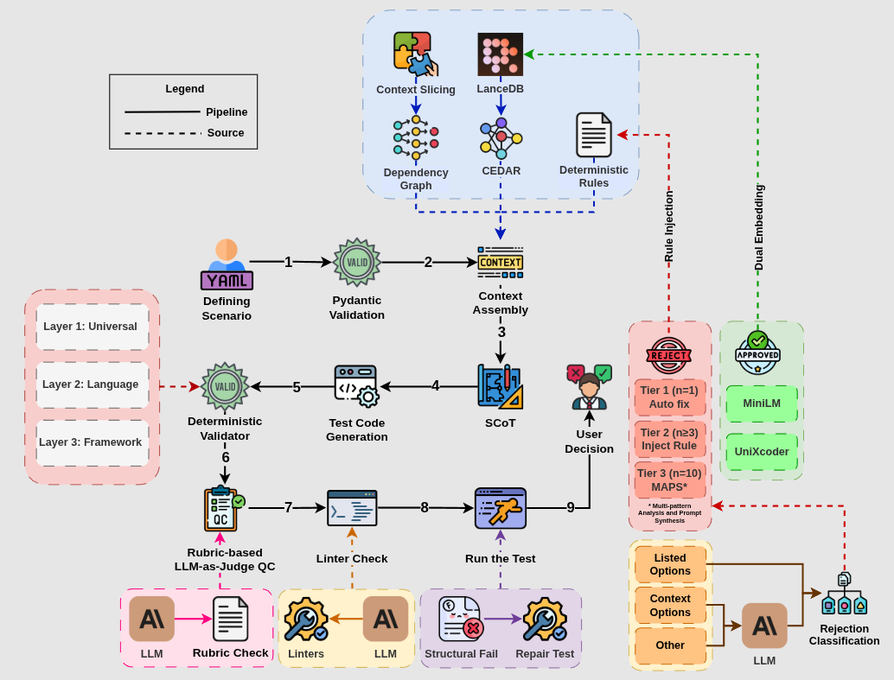

# Cognova

> ⚠️ **Work in Progress** — Cognova is under active development. APIs, features, and
> the architecture shown below are evolving and may change without notice. Not yet
> recommended for production use.

AI-powered test generation toolkit — MCP server for IDE integration.

## What It Does

- Generates test code from YAML scenario descriptions using Claude AI
- Supports 25+ testing frameworks (pytest, Jest, JUnit, Playwright, Robot, etc.)
- Validates generated code through deterministic rules + rubric-based LLM-as-Judge
- Learns from feedback to improve output over time
- Repairs broken tests and self-heals after code changes

Core principle: **AI generates, deterministic rules validate, humans approve.**

## Architecture

The end-to-end pipeline — from scenario definition through validation, generation,
linting, and the LLM-as-Judge review loop:



## Quick Start

Add to your IDE's MCP config:

```json
{
  "mcpServers": {
    "Cognova": {
      "command": "uvx",
      "args": ["cognova-mcp@latest"],
      "env": { "ANTHROPIC_API_KEY": "sk-ant-..." }
    }
  }
}
```

Then ask your IDE agent: "Initialize Cognova for this project"

## Status

Cognova is being built feature by feature. Phase 1 (core infrastructure) and
Phase 2 (scenario handling) are complete; later phases — context analysis, test
generation, repair, and self-healing — are in progress. Expect breaking changes
between releases until a stable `1.x` line is announced.

## Requirements

- Python 3.11+
- Anthropic API key ([console.anthropic.com](https://console.anthropic.com/settings/keys))

## License

MIT
